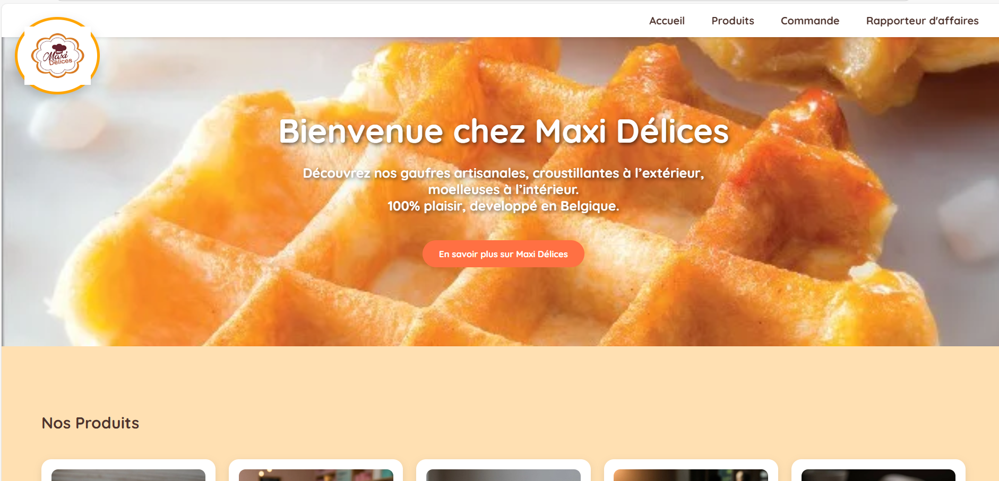

# 🍰 MaxiDélices — Site vitrine

Site vitrine professionnel réalisé pour la pâtisserie **MaxiDélices**.  
👉 **En ligne ici : [https://maxidelices.com](https://maxidelices.com)**

---

## 🧾 Description
Ce projet présente l’identité visuelle et les produits de la pâtisserie **MaxiDélices**, à travers un design moderne, responsive et chaleureux.  
Le site met en avant les gâteaux, pâtisseries et services de commande personnalisée.

---

## 🛠️ Technologies utilisées
- **HTML5**
- **CSS3** (responsive design)
- **JavaScript**
- **Images et contenus optimisés**

---

## 🌐 Démonstration
🔗 **Visiter le site :** [https://maxidelices.com](https://maxidelices.com)

📸 *Aperçu du site :*  

---

## 👨‍💻 Auteur
**Abdou Aziz Seck** — alias *DebugNinja10*  
💼 Développeur web & créateur de sites modernes au Sénégal.  
📩 Contact : [764361501 OU whatsapp: 762909494 ]

---

## ⚠️ Note
Ce dépôt contient les fichiers sources du site *MaxiDélices*.  
Les identifiants et fichiers sensibles (ex: config serveur) ne sont pas inclus.

## 📁 Structure du projet
